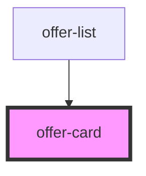

# offer-card

<!-- Auto Generated Below -->

## Properties

| Property      | Attribute     | Description | Type     | Default     |
| ------------- | ------------- | ----------- | -------- | ----------- |
| `description` | `description` |             | `string` | `undefined` |
| `name`        | `name`        |             | `string` | `undefined` |
| `offerId`     | `offer-id`    |             | `string` | `undefined` |
| `price`       | `price`       |             | `string` | `undefined` |

## Events

| Event        | Description | Type                  |
| ------------ | ----------- | --------------------- |
| `offerClick` |             | `CustomEvent<string>` |

## Dependencies

### Used by

 - [offer-list](../offer-list)

### Graph

----------------------------------------------

*Built with [StencilJS](https://stenciljs.com/)*
