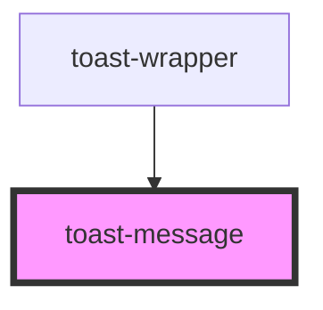

# toast-message

<!-- Auto Generated Below -->

## Properties

| Property  | Attribute | Description | Type                             | Default     |
| --------- | --------- | ----------- | -------------------------------- | ----------- |
| `message` | `message` |             | `string`                         | `undefined` |
| `variant` | `variant` |             | `"error" \| "info" \| "success"` | `'info'`    |

## Methods

### `showToast() => Promise<void>`

#### Returns

Type: `Promise<void>`

## Dependencies

### Used by

 - [toast-wrapper](../toast-wrapper)

### Graph

----------------------------------------------

*Built with [StencilJS](https://stenciljs.com/)*
