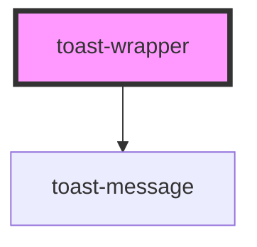

# toast-wrapper

<!-- Auto Generated Below -->

## Properties

| Property  | Attribute | Description | Type                             | Default     |
| --------- | --------- | ----------- | -------------------------------- | ----------- |
| `message` | `message` |             | `string`                         | `undefined` |
| `variant` | `variant` |             | `"error" \| "info" \| "success"` | `'info'`    |

## Dependencies

### Depends on

- [toast-message](../toast-message)

### Graph

----------------------------------------------

*Built with [StencilJS](https://stenciljs.com/)*
